# magicavoxel-shaders

[][release-link]
[][license-link]
[][mv-link]

> A collection of shaders for [MagicaVoxel](https://ephtracy.github.io/) to simplify common and repetitive tasks.

## Installation

Install these shaders by copying the files from the `shader` directory in this project into the `shader` directory of your MagicaVoxel installation.

## Issues

If you encounter an issue with these shaders, please review any [open issues][open-issues] and [create a new issue][new-issue] if one does not exist already.

## Shaders
<table>
	<tbody>
		<tr>
			<td style="background: #373737;">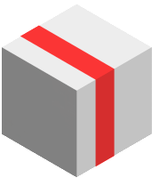</td>
			<th><a href="#slice_shader">Slice</a></th>
			<td>Remove segments from a model</td>
			<td><code>sx</code> <code>sy</code> <code>sz</code></td>
		</tr>
		<tr>
			<td style="background: #373737;">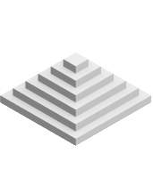</td>
			<th><a href="#pyramid_shader">Pyramid</a></th>
			<td>Generates a pyramid effect layer-by-layer</td>
			<td><code>py</code> <code>py2</code></td>
		</tr>
		<tr>
			<td style="background: #373737;">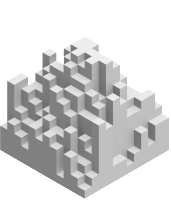</td>
			<th><a href="#sand_shader">Sand</a></th>
			<td>Generates a sand effect, layer-by-layer</td>
			<td><code>sand</code> <code>sand2</code></td>
		</tr>
		<tr>
			<td style="background: #373737;">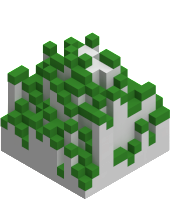</td>
			<th><a href="#soil_shader">Soil</a></th>
			<td>Adds a layer on top of voxels; i.e. sand or snow</td>
			<td><code>soil</code> <code>soil2</code> <code>soil3</code></td>
		</tr>
		<tr>
			<td style="background: #373737;">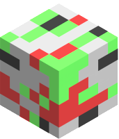</td>
			<th><a href="#bricks_shader">Bricks</a></th>
			<td>Generates a brick pattern of different colors and sizes</td>
			<td><code>bx</code> <code>by</code></td>
		</tr>
		<tr>
			<td style="background: #373737;">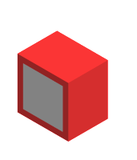</td>
			<th><a href="#case_shader">Case</a></th>
			<td>Encase voxels in voxels</td>
			<td><code>case</code></td>
		</tr>
		<tr>
			<td style="background: #373737;">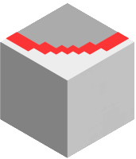</td>
			<th><a href="#outline_shader">Outline</a></th>
			<td>Generate an outline surrounding voxels</td>
			<td><code>outline</code> <code>outline2</code></td>
		</tr>
		<tr>
			<td style="background: #373737;">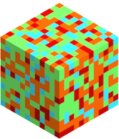</td>
			<th><a href="#noise_shader">Noise</a></th>
			<td>Add colored different sized noise</td>
			<td><code>noise</code></td>
		</tr>
		<tr>
			<td style="background: #373737;">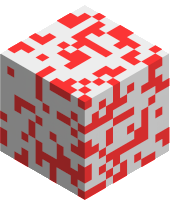</td>
			<th><a href="#rand_shader">Random</a></th>
			<td>Add noise at a specific probability</td>
			<td><code>rand</code></td>
		</tr>
		<tr>
			<td style="background: #373737;">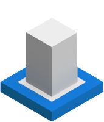</td>
			<th><a href="#flood_shader">Flood</a></th>
			<td>Add voxels bottom-up, as if it were flooding</td>
			<td><code>flood</code> <code>flood2</code></td>
		</tr>
		<tr>
			<td style="background: #373737;">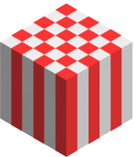</td>
			<th><a href="#grid_shader">Grid</a></th>
			<td>Generate a grid of different sizes</td>
			<td><code>grid</code></td>
		</tr>
		<tr>
			<td style="background: #373737;">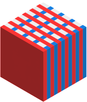</td>
			<th><a href="#lines_shader">Lines</a></th>
			<td>Generate lines</td>
			<td><code>lnx</code> <code>lny</code> <code>lnz</code></td>
		</tr>
	</tbody>
</table>

### Usage

<h3 id="slice_shader">Slice</h3>

```
xs sx [offset] [count]
xs sy [offset] [count]
xs sz [offset] [count]
```


The slice shaders removes one or more segments from the X, Y or Z-axis. All other segments are shuffled to full the available space. The first parameter `c` is the coordinate of the segment you wish to remove and `count` is the number of segments. Note that `count` is optional and defaults to `1`.

For example, in the first image, segments are removed with these commands:

```
xs sx 19 1
xs sy 15 1
```

<h3 id="pyramid_shader">Pyramid</h3>

```
xs py [index]
xs py2 [index]
```


The `py` and `py2` shaders add a layer of voxel on top of voxels matching the selected colour. A voxel is only added when the voxel beneath has adjacent voxels, creating the effect of a pyramid.

`py` will only add voxels when the adjacent voxels match the selected color. Whereas, `py2` will add voxels if there are adjacent voxels of any color.

If provided, `index` will be the color index of the added voxels. This parameter is optional; if ommitted (or set to `0`) the selected color index is used instead. 

Each time the shader is executed, a single layer is added. To add multiple layers at once, use `-n` to set a number of iterations:

```
xs -n 50 py
xs -n 50 py2
```


If neither axis modes (or both X and Y) are set, the shader will form a square pyramid. However, if either X or Y modes are set, the shader will form a pyramid with the slope facing the X or Y axes respectively.

<h3 id="sand_shader">Sand</h3>

```
xs sand [index] [add]
xs sand2 [index] [add]
```


The `sand` and `sand2` shaders add a layer voxels on top of voxels matching the selected colour. Voxels are added randomly and only added when the voxel beneath has adjacent voxels, creating the effect of a rough pile of sand. The number of adjacent neighbours affects the randomness, with a higher number of neighbours increasing the odds a voxel will be added.

If provided, `index` will be the color index of the added voxels. This parameter is optional; if ommitted (or set to `0`) the selected color index is used instead. 

`add` can be used to increase the odds of adding voxels. Numbers between `0.01` and `0.4` have the best effect. Because `add` is the second parameter, you can set `index` to `0` if using `add` in a loop.

Each time the shader is executed, a single layer is added. To add multiple layers at once, use `-n` to set a number of iterations:

```
xs -n 50 sand
xs -n 50 sand2 0 0.125
```

<h3 id="lines_shader">Lines</h3>

```
xs line [index] [spacing] [offset]
```


Replaces all voxels which match your selected color with lines set to the color passed as `index`. Setting the index to `0` will remove the voxels. Lines are spaced based on the `spacing` parameter, which defaults to `2`. Lines can be offset with the `offset` parameter. You should use axis modes to limit the lines to a particular axis.

<small>(This shader combines the <code>lnx</code>, <code>lny</code> and <code>lnz</code> shaders from the earlier versions.)</small>

<h3 id="soil_shader">Soil</h3>

```
xs soil [index] [headroom]
xs soil2 [index] [headroom]
xs soil3 [headroom]
```


The `soil` and `soil2` shaders adds voxels, set to the color passed as `index`, on top of voxels matching your selected colour. `soil` adds voxels, set as the selected color, on top of all voxels.

- Voxels are only added where there is empty space. By default, voxels are added if there is at least one empty space above, however you can adjust the number of voxels that are checked with `headroom`.
- `soil2` is similar to `soil`, except voxels are replaced instead of added on top.

<h3 id="bricks_shader">Bricks</h3>

```
xs bx [width] [depth] [height] [a] [b]
xs by [width] [depth] [height] [a] [b]
```

Generates a brick texture between two colors; `a` and `b`. The difference between the shaders is the facing direction of the bricks (if the bricks are not generating, try switching shader)

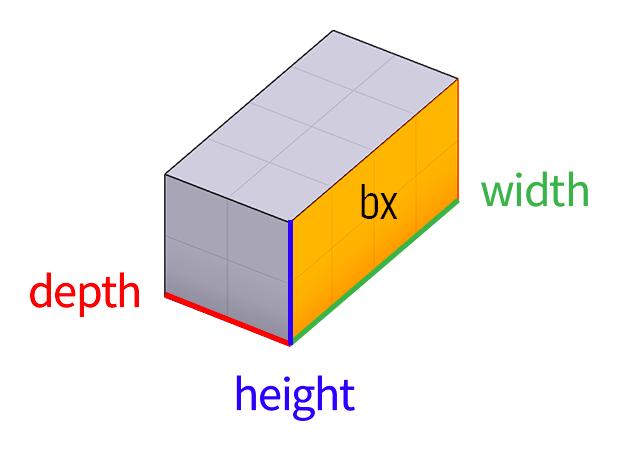  


**Examples**

To generate bricks between color `1` and `8`:

<table>
	<tbody>
		<tr>
			<td>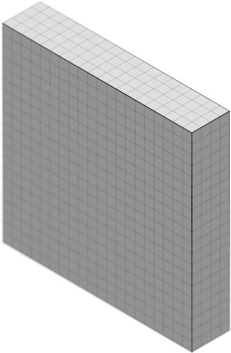</td>
			<td></td>
			<td></td>
		</tr>
		<tr>
			<td>Model</td>
			<td></td>
			<td></td>
		</tr>
		<tr>
			<td>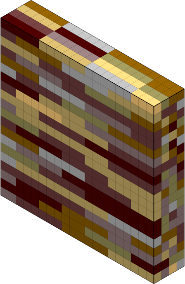</td>
			<td>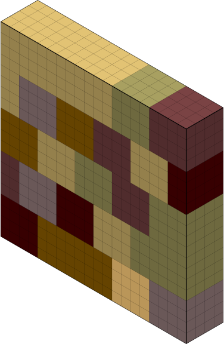</td>
			<td>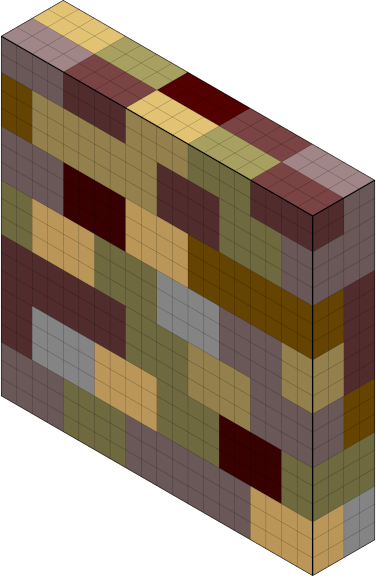</td>
		</tr>
		<tr>
			<td><code>xs bx 6 1 1 1 8</code></td>
			<td><code>xs bx 4 4 4 1 8</code></td>
			<td><code>xs bx 4 3 2 1 8</code></td>
		</tr>
		<tr>
			<td>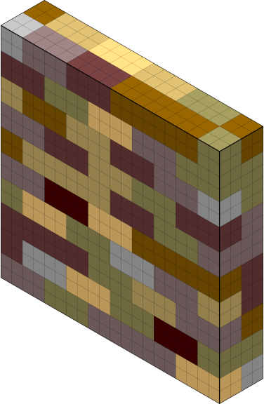</td>
			<td>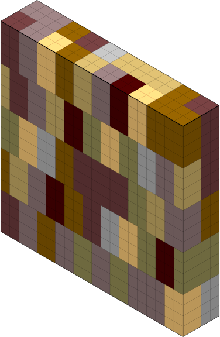</td>
			<td>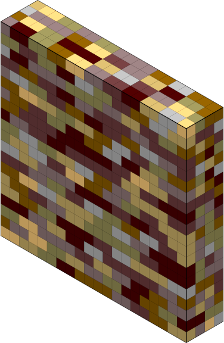</td>
		</tr>
		<tr>
			<td><code>xs bx 6 4 2 1 8</code></td>
			<td><code>xs bx 4 2 4 1 8</code></td>
			<td><code>xs bx 4 2 1 1 8</code></td>
		</tr>
	</tbody>
</table>


<h3 id="case_shader">Case</h3>

```
xs case [index]
```


Surrounds (encases) the all voxels which match your selected color. Axis modes can use used to only add voxels on certain axes. The outline color will be the provided index.

This shader is similar to the _Dilation_ tool; except you can select an axis mode and target color.
 
<h3 id="outline_shader">Outline</h3>

```
xs outline [color]
xs outline2 [color]
```


Replaces all voxels which match your selected color which are adjacent to another voxel of a different color. The outline color will be the provided `color`. Setting the index to `0` will remove the voxels.

`outline2` is similar to `outline`, but produces thinner lines.

<h3 id="grid_shader">Grid</h3>

```
xs grid [index] [x] [y] [xoffset] [yoffset]
```


Replaces all voxels which match your selected color with a grid with a cell size determined by `x` and `y`. Grid cells are colored based on the provided `index`. Setting the index to `0` will remove the voxels. Grids can be square or rectangular. You can offset the position of the grid with `xoffset` and `yoffset` parameters, which default to `0`.

<h3 id="noise_shader">Noise</h3>

```
xs noise [a] [b] [size_x] [size_y] [size_z]
```


Replaces all voxels which match your selected color with a randomly chosen color within a range of colors (`a` and `b`, inclusive). `size_x`, `size_y` and `size_z` can be used to increase the size to be larger than a single voxel. For example, `3 3 3` will randomly generate noise in 3 x 3 x 3 cubes.


Voxels are replaced across all axes. The shader can be limited to the X, Y, or Z-axis (or a combination) by setting an axis mode.

<h3 id="rand_shader">Random</h3>

```
xs rand [f] [index]
```


Replaces all voxels which match your selected color with a randomly chosen index. If `index` is 0, voxels are randomly removed instead. You can control the threshold by adjusting the `f` value. Values closer to `0.0` will replace more voxels. Values closer to `1.0` will replace less.


Voxels are replaced across all axes. You can randomize the X, Y, or Z-axis (or a combination) with the axis mode.

<h3 id="flood_shader">Flood</h3>

```
xs flood [n]
xs flood2 [n]
```


Adds `n` number of layers of voxels of your selected color from the bottom of your model upwards. Voxels are only added to empty space and won't replace existing voxels.

`flood2` is similar to `flood`, except flooding stops when a voxel is encountered so that exclosed spaces aren't filled.

[release-link]: https://github.com/lachlanmcdonald/magicavoxel-shaders/releases
[license-link]: https://github.com/lachlanmcdonald/magicavoxel-shaders/blob/master/LICENSE.md
[mv-link]: https://ephtracy.github.io/
[open-issues]: https://github.com/lachlanmcdonald/magicavoxel-shaders/issues?q=is%3Aopen+is%3Aissue
[new-issue]: https://github.com/lachlanmcdonald/magicavoxel-shaders/issues/new
